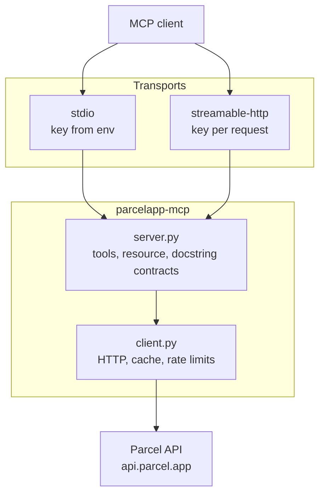

# parcelapp-mcp


An MCP server for [Parcel](https://parcelapp.net), the iOS/macOS delivery
tracking app. It wraps Parcel's external API (a premium feature of the app)
so an LLM client can list your deliveries, add new ones to track, and look up
carrier codes, over either stdio or streamable HTTP.

This project is not affiliated with or endorsed by Parcel.

## 🚀 Features

| | Feature | Notes |
| --- | --- | --- |
| 📦 | List deliveries | Recent or active, with filtering and sorting, served from a 3-minute cache |
| ➕ | Add a delivery | Validated locally first, so a typo never spends part of the daily quota |
| 🔍 | Search carriers | Free, unrated lookup from code or name to the internal carrier code |
| 📡 | Resource template | `parcel://deliveries/{filter_mode}` for passive reads alongside the tools |
| 🔐 | Two auth modes | Environment variable over stdio, per-request header over HTTP |
| 🚦 | Rate-limit awareness | Every result reports an honest, locally-tracked budget estimate |
| 🐳 | Container-ready | Ships a Dockerfile for the HTTP transport, no key baked in |

## ⚡ Quickstart

Run it directly with [uv](https://docs.astral.sh/uv/), no install step:

```bash
PARCEL_TOKEN=your-parcel-api-key uvx parcelapp-mcp
```

Get a key at <https://web.parcelapp.net> (requires a Parcel premium
subscription). Pin a version with `uvx parcelapp-mcp@0.2.0`, or track the
latest release with `uvx parcelapp-mcp@latest`.

To wire it into an MCP client such as Claude Desktop, add:

```json
{
  "mcpServers": {
    "parcel": {
      "command": "uvx",
      "args": ["parcelapp-mcp"],
      "env": { "PARCEL_TOKEN": "your-parcel-api-key" }
    }
  }
}
```

## 📦 Installation

### Local

```bash
# Persistent install, on your PATH
uv tool install parcelapp-mcp

# Or, inside a virtualenv (a bare `pip install` fails outside one on
# externally-managed pythons such as Homebrew's or Debian's)
python -m venv .venv
source .venv/bin/activate
pip install parcelapp-mcp
```

### 🐳 Docker

The image serves the streamable-http transport only; it holds no credential,
since the key travels with each request instead.

```bash
docker pull ghcr.io/obeone/parcelapp-mcp
docker run -p 8000:8000 ghcr.io/obeone/parcelapp-mcp
```

Images are published on every `v*` tag, for `linux/amd64` and `linux/arm64`, to
both `ghcr.io/obeone/parcelapp-mcp` and `docker.io/obeoneorg/parcelapp-mcp`, with
an SBOM and a provenance attestation attached.

Every image is signed with [cosign](https://docs.sigstore.dev/cosign/), keylessly:
there is no public key to distribute, the signature is bound to the workflow that
produced it and recorded in Sigstore's public transparency log. Check one before
you run it:

```bash
cosign verify ghcr.io/obeone/parcelapp-mcp:0.2.0 \
  --certificate-identity-regexp '^https://github.com/obeone/parcelapp-mcp/' \
  --certificate-oidc-issuer https://token.actions.githubusercontent.com
```

To build it yourself instead:

```bash
docker build -t parcelapp-mcp \
  --build-arg VERSION="$(git describe --tags --abbrev=0 | sed 's/^v//')" .
docker run -p 8000:8000 parcelapp-mcp
```

The `VERSION` build argument matters: `.dockerignore` excludes `.git`, and the
package version is derived from the git tag, so without it the build still
succeeds but reports version `0.0.0`.

Call it with your key in a header (use `127.0.0.1`, not `localhost`: on
macOS `localhost` resolves to `::1` first, and `-p 8000:8000` only publishes
IPv4):

```bash
curl http://127.0.0.1:8000/mcp \
  -H "Content-Type: application/json" \
  -H "Accept: application/json, text/event-stream" \
  -H "X-Parcel-Token: your-parcel-api-key" \
  -d '{"jsonrpc":"2.0","id":1,"method":"initialize","params":{"protocolVersion":"2025-06-18","capabilities":{},"clientInfo":{"name":"curl","version":"0"}}}'
```

The HTTP transport does not authenticate callers: it partitions its cache and
rate-limit counters by a fingerprint of the key so two callers never see each
other's parcels, but anyone who can reach the port can relay a request using
their own key. Put it behind a network boundary you control, or add your own
auth in front of it.

## ⚙️ Configuration

| Variable | Default | Meaning |
| --- | --- | --- |
| `PARCEL_TOKEN` | none | API key, stdio transport. Falls back to `PARCEL_API_KEY` |
| `PARCEL_API_KEY` | none | Alternate name for the key above |
| `PARCEL_TRANSPORT` | `stdio` | `stdio` or `streamable-http` |
| `PARCEL_HOST` | `127.0.0.1` | Bind address for `streamable-http` |
| `PARCEL_PORT` | `8000` | Port for `streamable-http` |
| `PARCEL_PATH` | `/mcp` | URL path for `streamable-http` |
| `PARCEL_LOG_LEVEL` | `INFO` | Python logging level |

Over HTTP, a request's own key always wins: send it as `X-Parcel-Token` or
`Authorization: Bearer <key>`. The environment variables are only the stdio
path and the HTTP fallback.

Each CLI flag mirrors one of these: `--transport`, `--host`, `--port`,
`--path`.

## 🛠️ Development

| Command | Purpose |
| --- | --- |
| `uv sync` | Install dependencies, including the dev group |
| `uv run pytest` | Run the 80-test suite (mocked, no network) |
| `uv run ruff check` | Lint |
| `uv run ruff format` | Format |
| `uv run mypy` | Strict type-check |
| `envchain parcel uv run parcelapp-mcp` | Run over stdio with a local key |
| `envchain parcel uv run scripts/smoke_test.py` | Live, read-only in-process check |
| `envchain parcel uv run scripts/stdio_test.py` | Live end-to-end check over stdio |
| `envchain parcel uv run scripts/http_test.py` | Live check against a running HTTP server |

CI runs lint, type-check and the test matrix (Python 3.10 to 3.13) on every
push and pull request against `main`.

## 📡 API

Three MCP tools, all documented in detail through their own docstrings (the
text a model actually reads at call time):

| Tool | Upstream limit | Summary |
| --- | --- | --- |
| `list_deliveries` | 20 / hour | Recent or active deliveries, with status, carrier name and events resolved |
| `add_delivery` | 20 / day | Adds a tracking number; rejects an unknown carrier or a missing required field before spending a request |
| `search_carriers` | none | Looks up a carrier code by name or code, including whether it needs a postcode or email |

Plus one resource template, `parcel://deliveries/{filter_mode}` (`active` or
`recent`), for reading the same listing without a tool call.

Every result carries a `rate_limit` block. Parcel publishes no rate-limit
headers, so the figures are counted locally by this server and reported as
`remaining_at_most`: the Parcel app itself, or another client sharing the
same key, can spend from the same budget invisibly.

### Upstream quirks

Three behaviours that look like bugs here and are not:

- **A listing is never fresh.** It returns Parcel's own cached view of your
  deliveries. Nothing in this API asks a carrier for an update on demand.
- **A newly added delivery looks empty.** It shows "No data available" until
  Parcel's next update cycle reaches it, and nothing can force that.
- **A tracking number must match a format a carrier recognises.** For a
  placeholder with no real number behind it, pass `carrier_code: "pholder"`.

## 🚀 Releases

Pushing a `v*` tag drives the whole pipeline: build and test, publish to
PyPI via Trusted Publishing, create the GitHub release, and regenerate
`CHANGELOG.md` with [git-cliff](https://git-cliff.org) from the Conventional
Commit history, then build and push the multi-architecture image to both
registries. Nothing here is versioned by hand.

## 🏗️ Architecture



## 📝 License

MIT, see [LICENSE](LICENSE).

Made by Grégoire Compagnon (obeone)
