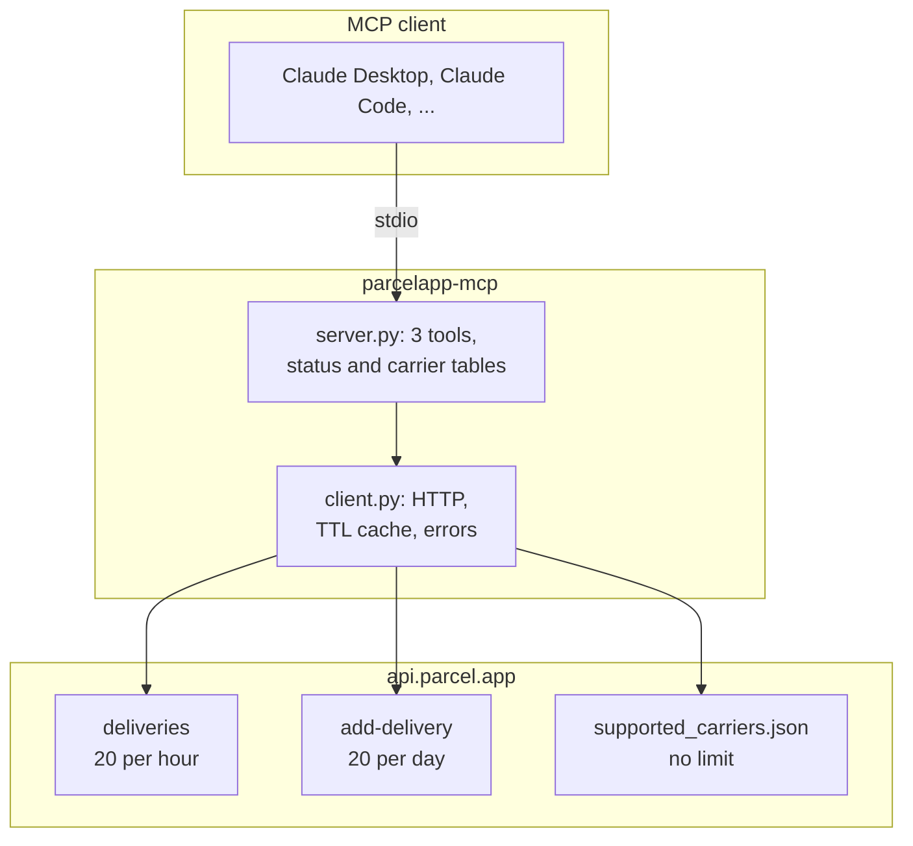

# parcelapp-mcp


[](https://github.com/obeone/parcelapp-mcp/actions/workflows/ci.yml)

An MCP server for [Parcel](https://parcelapp.net), the macOS and iOS delivery
tracking app. It lets a model read your deliveries, add new ones, and look up
the carrier codes the API needs, over the small external API that Parcel
premium accounts get.

The server is deliberately thin. The upstream API is tiny and heavily rate
limited, so the value added here is not abstraction, it is legibility: carrier
codes resolved to names, numeric status codes resolved to text, and required
fields validated locally before a request is spent.

---

## ✨ Features

| | Feature | Why it matters |
| --- | --- | --- |
| 📦 | Lists recent or active deliveries | Status codes and carrier codes come back as words, not integers |
| ➕ | Adds a delivery | Validated locally first, so a typo never costs one of your 20 daily requests |
| 🔍 | Searches the carrier catalogue | Finds the internal code for a carrier, and says whether it needs a postcode or an email |
| ⏱️ | Caches locally | 3 minutes for deliveries, 24 hours for carriers, to protect a tight hourly budget |
| 💬 | Errors that name the fix | "Bpost requires a postcode; pass `postcode`" rather than "invalid request" |

---

## 🚀 Quickstart

You need a Parcel premium account and an API key from
[web.parcelapp.net](https://web.parcelapp.net).

```bash
export PARCEL_TOKEN="your-key"
uvx --from git+https://github.com/obeone/parcelapp-mcp parcelapp-mcp
```

That runs the server on stdio. In practice you will not run it by hand, you
will point an MCP client at it. See Configuration below.

---

## 📦 Installation

### With uvx, no checkout

```bash
uvx --from git+https://github.com/obeone/parcelapp-mcp parcelapp-mcp
```

### From a local clone

```bash
git clone https://github.com/obeone/parcelapp-mcp
cd parcelapp-mcp
uv sync
uv run parcelapp-mcp
```

---

## ⚙️ Configuration

| Variable | Required | Purpose |
| --- | --- | --- |
| `PARCEL_TOKEN` | yes | API key from [web.parcelapp.net](https://web.parcelapp.net), sent as the `api-key` header |
| `PARCEL_API_KEY` | no | Accepted as a fallback if `PARCEL_TOKEN` is unset |
| `PARCEL_LOG_LEVEL` | no | Python log level, default `INFO` |

### Claude Code

```bash
claude mcp add parcel -e PARCEL_TOKEN=your-key -- \
    uvx --from git+https://github.com/obeone/parcelapp-mcp parcelapp-mcp
```

### Claude Desktop

In `claude_desktop_config.json`:

```json
{
  "mcpServers": {
    "parcel": {
      "command": "uvx",
      "args": [
        "--from",
        "git+https://github.com/obeone/parcelapp-mcp",
        "parcelapp-mcp"
      ],
      "env": { "PARCEL_TOKEN": "your-key" }
    }
  }
}
```

### Keeping the key out of a config file

On macOS, [envchain](https://github.com/sorah/envchain) stores it in the
Keychain and injects it only into the wrapped command:

```bash
envchain --set parcel PARCEL_TOKEN
```

```json
{
  "mcpServers": {
    "parcel": {
      "command": "envchain",
      "args": [
        "parcel",
        "uvx",
        "--from",
        "git+https://github.com/obeone/parcelapp-mcp",
        "parcelapp-mcp"
      ]
    }
  }
}
```

---

## 🧰 Tools

| Tool | Arguments | Upstream rate limit |
| --- | --- | --- |
| `list_deliveries` | `filter_mode`: `recent` (default) or `active` | 20 per hour |
| `add_delivery` | `tracking_number`, `carrier_code`, `description`, and optionally `language`, `send_push_confirmation`, `postcode`, `email` | 20 per day, failed attempts included |
| `search_carriers` | `query`, `limit` | none |

`search_carriers` is the one to call first: `add_delivery` needs an internal
carrier code such as `lp` (La Poste) or `chrono` (Chronopost), and it reports
which carriers additionally require a postcode or an email.

---

## ⚠️ Limitations

These come from the upstream API, not from this server. They are worth knowing
before you build on it.

| Limitation | Detail |
| --- | --- |
| Two endpoints, that is all | The Parcel external API exposes reading deliveries and adding one. There is no delete, no edit, no refresh. |
| Tight budgets | 20 delivery listings per hour. 20 additions per day, and a rejected addition still counts. |
| Reads are never fresh | Listing deliveries returns the Parcel server's cached view and does not ask the carrier for an update. |
| New deliveries look empty | A delivery added through the API shows "No data available" until the Parcel server's first update. |
| One at a time | `add_delivery` takes a single delivery, and the tracking number must match a format the server recognises. Use `carrier_code: "pholder"` for a placeholder with no real carrier. |
| Premium only | The API is available to Parcel premium accounts. |
| Barely documented | Two help pages, [reading](https://parcelapp.net/help/api-view-deliveries.html) and [adding](https://parcelapp.net/help/api-add-delivery.html). Everything else here was established by observation and is handled defensively. |

---

## 🧪 Development

```bash
uv sync
uv run pytest        # 42 tests, no network
uv run ruff check
uv run ruff format
uv run mypy          # strict
```

The suite mocks the upstream with `respx`, so it costs nothing from either rate
limit. Two live scripts remain as manual checks against the real API. Both are
read only and neither calls `add_delivery`:

```bash
envchain parcel uv run scripts/smoke_test.py   # in process
envchain parcel uv run scripts/stdio_test.py   # through a real MCP client
```

CI runs lint and type checks once, then the suite on Python 3.10 through 3.13.

---

## 🏗️ Architecture



`add_delivery` checks the carrier code and any required postcode or email
against the cached catalogue before it touches the network, because a rejected
request costs the same as a successful one.

---

## 📝 License

MIT, see [LICENSE](LICENSE). Not affiliated with Parcel or its developer.

Made by Grégoire Compagnon (obeone)
