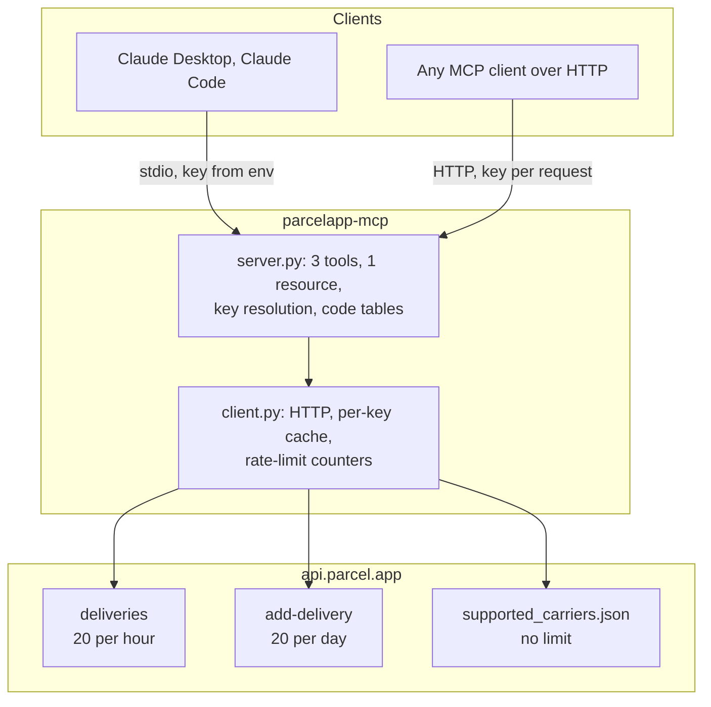

# parcelapp-mcp


[](https://github.com/obeone/parcelapp-mcp/actions/workflows/ci.yml)

An MCP server for [Parcel](https://parcelapp.net), the macOS and iOS delivery
tracking app. It lets a model read your deliveries, add new ones, and look up the
carrier codes the API needs, over the small external API that Parcel premium
accounts get.

The server is deliberately thin. The upstream API is tiny and heavily rate
limited, so the value added here is not abstraction, it is legibility: carrier
codes resolved to names, numeric status codes resolved to text, required fields
validated locally before a request is spent, and every result carrying how much
of the rate-limit budget is left.

It runs two ways. Over **stdio** it is a personal server reading your key from the
environment. Over **HTTP** the key travels with each request, so one deployment
serves several people without ever holding anyone's credential.

---

## ✨ Features

| | Feature | Why it matters |
| --- | --- | --- |
| 📦 | Lists recent or active deliveries | Status codes and carrier codes come back as words, not integers |
| ➕ | Adds a delivery | Validated locally first, so a typo never costs one of your 20 daily requests |
| 🔍 | Searches the carrier catalogue | Finds the internal code, and says whether it needs a postcode or an email |
| 🎚️ | Filters and sorts server-side | Narrowing happens after the fetch, so it costs no extra request |
| 📊 | Reports the rate-limit budget | Every result says what has been spent, so a model can pace itself |
| 🔑 | Per-request keys over HTTP | One container serves several people; it stores no credential |
| ⏱️ | Caches locally | 3 minutes for deliveries, 24 hours for carriers, partitioned per key |
| 💬 | Errors that name the fix | "Bpost requires a postcode; pass `postcode`" rather than "invalid request" |

---

## 🚀 Quickstart

You need a Parcel premium account and an API key from
[web.parcelapp.net](https://web.parcelapp.net).

```bash
export PARCEL_TOKEN="your-key"
uvx --from git+https://github.com/obeone/parcelapp-mcp parcelapp-mcp
```

That runs the server on stdio. In practice you point an MCP client at it rather
than running it by hand: see Configuration.

---

## 📦 Installation

### With uvx, no checkout

```bash
uvx --from git+https://github.com/obeone/parcelapp-mcp parcelapp-mcp
```

### From a local clone

```bash
git clone https://github.com/obeone/parcelapp-mcp
cd parcelapp-mcp
uv sync
uv run parcelapp-mcp
```

### With Docker, for the HTTP transport

The image holds no key. Every caller sends their own, so the container is safe
to share.

```bash
docker build -t parcelapp-mcp .
docker run -d --name parcel -p 8000:8000 parcelapp-mcp
```

```bash
curl -sS -X POST http://127.0.0.1:8000/mcp \
  -H 'Content-Type: application/json' \
  -H 'Accept: application/json, text/event-stream' \
  -H 'X-Parcel-Token: your-key' \
  -d '{"jsonrpc":"2.0","id":1,"method":"initialize","params":{"protocolVersion":"2025-06-18","capabilities":{},"clientInfo":{"name":"curl","version":"0"}}}'
```

`127.0.0.1` rather than `localhost` on purpose: `localhost` resolves to `::1`
first on macOS, and `-p 8000:8000` publishes on IPv4 only, so the connection is
refused for a reason that has nothing to do with this server.

---

## ⚙️ Configuration

### Environment

| Variable | Required | Purpose |
| --- | --- | --- |
| `PARCEL_TOKEN` | on stdio | API key from [web.parcelapp.net](https://web.parcelapp.net), sent upstream as the `api-key` header |
| `PARCEL_API_KEY` | no | Accepted as a fallback if `PARCEL_TOKEN` is unset |
| `PARCEL_TRANSPORT` | no | `stdio` (default) or `streamable-http` |
| `PARCEL_HOST` | no | Bind address for HTTP. Default `127.0.0.1`, `0.0.0.0` in the image |
| `PARCEL_PORT` | no | Port for HTTP. Default `8000` |
| `PARCEL_PATH` | no | URL path for HTTP. Default `/mcp` |
| `PARCEL_LOG_LEVEL` | no | Python log level. Default `INFO` |

Every variable has a command-line equivalent: `--transport`, `--host`, `--port`,
`--path`.

### Sending the key over HTTP

Two headers are accepted, checked in this order:

```http
X-Parcel-Token: your-key
Authorization: Bearer your-key
```

If neither is present the server falls back to its own environment, which is what
makes the same code work on stdio. When nothing supplies a key, the error names
both routes rather than saying "unauthorised".

### Claude Code

```bash
claude mcp add parcel -e PARCEL_TOKEN=your-key -- \
    uvx --from git+https://github.com/obeone/parcelapp-mcp parcelapp-mcp
```

### Claude Desktop

In `claude_desktop_config.json`:

```json
{
  "mcpServers": {
    "parcel": {
      "command": "uvx",
      "args": [
        "--from",
        "git+https://github.com/obeone/parcelapp-mcp",
        "parcelapp-mcp"
      ],
      "env": { "PARCEL_TOKEN": "your-key" }
    }
  }
}
```

### Keeping the key out of a config file

On macOS, [envchain](https://github.com/sorah/envchain) stores it in the Keychain
and injects it only into the wrapped command:

```bash
envchain --set parcel PARCEL_TOKEN
```

```json
{
  "mcpServers": {
    "parcel": {
      "command": "envchain",
      "args": [
        "parcel",
        "uvx",
        "--from",
        "git+https://github.com/obeone/parcelapp-mcp",
        "parcelapp-mcp"
      ]
    }
  }
}
```

---

## 🧰 Tools

| Tool | Arguments | Upstream rate limit |
| --- | --- | --- |
| `list_deliveries` | `filter_mode`, `status`, `sort_by` | 20 per hour |
| `add_delivery` | `tracking_number`, `carrier_code`, `description`, plus optional `language`, `send_push_confirmation`, `postcode`, `email` | 20 per day, failed attempts included |
| `search_carriers` | `query`, `limit` | none |

`search_carriers` is the one to call first: `add_delivery` needs an internal
carrier code such as `lp` (La Poste) or `chrono` (Chronopost), and it reports
which carriers additionally require a postcode or an email.

### Resource

`parcel://deliveries/{filter_mode}` exposes the same listing for passive reading,
with `active` or `recent`. It shares the cache and the hourly budget with
`list_deliveries`, so consulting it cannot quietly drain the allowance.

### The rate-limit block

Every delivery result carries one:

```json
{
  "limit": 20,
  "per": "hour",
  "spent_by_this_server": 3,
  "remaining_at_most": 17,
  "note": "Counted locally: Parcel returns no rate-limit headers. ..."
}
```

It says `remaining_at_most` rather than `remaining` on purpose. Parcel publishes
no counter and returns no rate-limit headers, so this is counted here: it sees
only the requests this process sent since it started. The Parcel app on your
phone spends from the same budget, invisibly.

---

## ⚠️ Limitations

These come from the upstream API, not from this server.

| Limitation | Detail |
| --- | --- |
| Two endpoints, that is all | Reading deliveries and adding one. No delete, no edit, no refresh. |
| Tight budgets | 20 listings per hour. 20 additions per day, and a rejected addition still counts. |
| No rate-limit headers | The API returns none, so any budget figure, including this server's, is an estimate. |
| Reads are never fresh | Listing returns the Parcel server's cached view; it does not ask the carrier. |
| New deliveries look empty | One added through the API shows "No data available" until the server's first update, and nothing can force it. |
| One at a time | `add_delivery` takes a single delivery, and the tracking number must match a recognised format. Use `carrier_code: "pholder"` for a placeholder. |
| Premium only | The API is available to Parcel premium accounts. |
| Barely documented | Two help pages, [reading](https://parcelapp.net/help/api-view-deliveries.html) and [adding](https://parcelapp.net/help/api-add-delivery.html). Everything else here was established by observation and is handled defensively. |

The HTTP mode has one of its own: it does not authenticate callers. It forwards
whatever key it is given and partitions its cache by a fingerprint of that key,
so callers cannot see each other's parcels, but anyone who can reach the port can
use it as a relay with their own key. Put it behind something that decides who
may connect before exposing it beyond localhost.

---

## 🧪 Development

```bash
uv sync
uv run pytest        # 80 tests, no network
uv run ruff check
uv run ruff format
uv run mypy          # strict
```

The suite mocks the upstream with `respx`, so it costs nothing from either rate
limit. Three live scripts remain as manual checks against the real API, all
read-only, none of which calls `add_delivery`:

```bash
envchain parcel uv run scripts/smoke_test.py   # in process
envchain parcel uv run scripts/stdio_test.py   # through a real MCP client
envchain parcel uv run scripts/http_test.py    # against a running HTTP server
```

CI runs lint and type checks once, then the suite on Python 3.10 through 3.13.

---

## 🏗️ Architecture



Two rules hold this together. `add_delivery` checks the carrier code and any
required postcode or email against the cached catalogue before touching the
network, because a rejected request costs the same as a successful one. And
everything cached or counted is keyed by a fingerprint of the caller's API key,
so a shared HTTP deployment cannot serve one person's parcels to another.

---

## 📝 License

MIT, see [LICENSE](LICENSE). Not affiliated with Parcel or its developer.

Made by Grégoire Compagnon (obeone)
